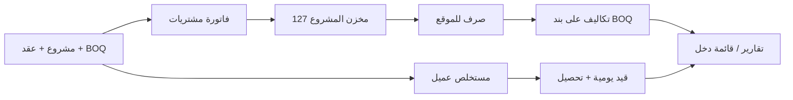

# دليل تدفق العمليات — Web Cost App

ملف خارجي للشرح (نصي + لقطات شاشة).  
لتحديث اللقطات من التطبيق الحي:

```powershell
cd "D:\cost web app\web-cost-app"
# تأكد أن npm run dev:local يعمل
$env:SCREENSHOT_EMAIL="your@email.com"
$env:SCREENSHOT_PASSWORD="your-password"
npm run docs:screenshots
```

عرض تقديمي بنفس المحتوى: افتح `slides.html` في المتصفح.

---

## خريطة التدفق العامة



---

## 1) تسجيل الدخول وسطح المكتب


1. افتح التطبيق على `http://localhost:3000` (أو رابط Railway / Electron).
2. سجّل الدخول بكلمة المرور (محلي / سطح المكتب) أو Google حسب البيئة.
3. من الشريط الجانبي تفتح **موديولاً واحداً** في كل مرة (الآلة الحاسبة استثناء).

---

## 2) المكتب الفني — مشروع → عقد → BOQ → مستخلص


| الخطوة | ماذا تفعل | لماذا |
|--------|-----------|--------|
| مشروع | إنشاء مشروع وربطه بشعار الكفر إن لزم | أساس العقود والمستخلصات |
| عقد | إضافة عقد تحت المشروع | مركز تكلفة + نطاق BOQ |
| جدول كميات | بنود + أسعار (مواد/عمالة/معدات + OH + ربح) | ميزانية وتقدّم |
| أمر تغيير VO | بنود إضافية معتمدة | تظهر في كفر المستخلص كـ «إضافي» |
| مستخلص عميل | كميات فترة + كفر Cover-JLL | قيد عند الاعتماد فقط |

**لا تراجع:** صافي المستحق على الكفر = Sub-Total − استقطاعات − Previous Payments (وليس أعمال الفترة وحدها).

---

## 3) التكاليف الفعلية — فاتورة مشتريات


**التدفق:**

1. تبويب **فاتورة مشتريات**.
2. اختر نوع الدفع: آجلة (مورد `21101…`) أو نقدية (عهدة `12102…`).
3. اختر مخزن المشروع (`127…`) وأضف بنود الأصناف (مع ربط BOQ اختياري).
4. احفظ — يُرحَّل القيد والمخزون معاً في الوضع المحلي (`post-invoice`).

**بديل شائع:** استلام مخزني غير مسعّر أولاً → ثم تسعير عبر فاتورة مربوطة بالاستلام (لا قيد `WR-` من المخزن).

---

## 4) المخازن — رصيد → صرف → إرجاع


```text
فاتورة / استلام  →  رصيد مخزن المشروع
       ↓
أمر صرف (CON-…)  →  تكلفة على بنود BOQ + قيد مصروف
       ↓
إذن إرجاع (RET-…) ← عكس جزئي عند الحاجة
```

1. تبويب **الرصيد**: مشروع مربوط بحساب `127…`.
2. **صرف**: صنف/أصناف → توزيع على بنود BOQ → حساب مصروف واحد للأمر.
3. **سجل الصرف والإرجاع**: متابعة `CON-` / `RET-` والطباعة.

---

## 5) الأستاذ العام


1. طبّق **الفلاتر** أولاً (لا تحميل تلقائي لكل القيود).
2. دفتر اليومية: قيد يدوي / عكس / تراجع عن العكس.
3. كشف حساب: حركة حساب ورقة واحد (8 أرقام).
4. تحرير شجرة الحسابات من **الإعدادات** وليس من اليومية.

---

## 6) البنوك


| تبويب | الاستخدام |
|-------|-----------|
| كشف حساب بنكي | اختيار بنك + كشف GL |
| المعاملات | حركات + شيكات في قائمة واحدة |
| كشوف البنك | تسوية كشف البنك |

- تحويل موحّد: داخلي/خارجي × قناة × اتجاه.
- شيك وارد/صادر: مرحلة ISS ثم CLR (تحصيل/صرف).

---

## 7) الموارد البشرية (الرواتب)


1. تعريف الموظفين + توزيع مراكز التكلفة.
2. كشف مسودة → **قالب/استيراد الأيام** (حضور وإجازات…).
3. مراجعة مكافأة/حافز/سلف (التأمينات والضريبة للقراءة).
4. **معاينة القيد** ثم استحقاق → صرف لاحقاً.

---

## 8) التقارير ولوحة التحكم


- قائمة الدخل / الميزانية / ميزان المراجعة / السيولة / تكاليف BOQ / ميزانية مقابل فعلي.
- الطباعة عبر معاينة موحّدة (`ReportPreviewDialog`) — ليست طباعة مباشرة لواجهة الشاشة.

---

## 9) الأصول الثابتة والإعدادات


- شراء أصل ثابت من فاتورة التكاليف (حساب `11…`) ثم إكمال الإهلاك في موديول الأصول.
- الإعدادات: مستخدمون، نسخة احتياطية، شجرة حسابات، مراكز غير مباشرة (للمدير).

---

## مسارات ذهبية سريعة للتحقق

1. **شراء → مخزن → صرف:** فاتورة آجلة بأصناف → رصيد `127` يزيد → صرف `CON-` يظهر في اليومية وتكاليف BOQ.
2. **مستخلص عميل:** مسودة → كفر يطابق Sub − استقطاعات − PP → اعتماد → قيد متوازن.
3. **رواتب:** أيام → معاينة قيد → استحقاق.

---

## ملاحظات

- اللقطات تعكس بيانات بيئة التشغيل وقت الالتقاط (محلي ≠ Railway).
- إن ظهرت صورة فارغة أو `_debug-failure.png` أعد تشغيل `dev:local` ثم السكربت بعد تسجيل دخول صحيح.
- الشرح التفصيلي خطوة بخطوة موجود أيضاً داخل التطبيق: **دليل الاستخدام** (زر `?`).
