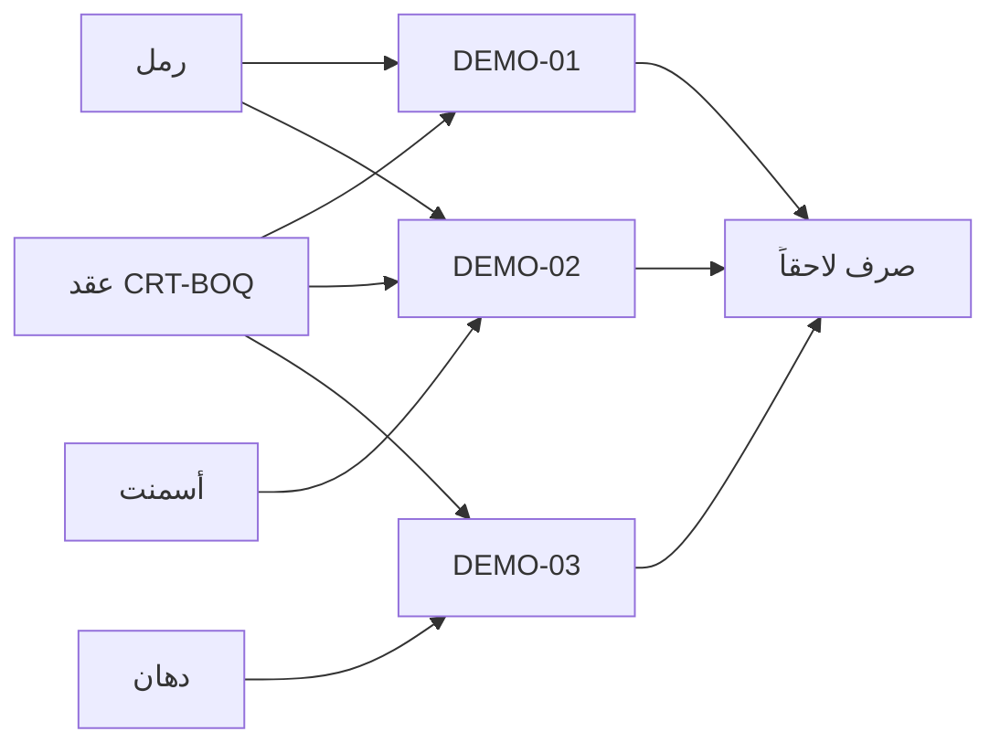

# عرض: عقد + قائمة كميات (3 بنود) + ربط أصناف المخزن

البيانات على المشروع التجريبي `PRJ-DEMO-20260812`.

```powershell
npm run docs:demo-boq -- --headed
# إن انتهت الجلسة:
npm run docs:demo-boq -- --manual-login
```

شرائح: `slides.html`

---

## ظهور البنود في الواجهة

البيانات موجودة في Postgres على:

- المشروع: **`PRJ-DEMO-20260812`**
- العقد: **`CRT-BOQ-20260812`**

موديول قوائم الكميات يفتح تلقائياً على **أول مشروع** في القائمة (`PRJ-2026-001`)، لذلك قد تبدو القائمة فارغة من البنود التجريبية.

**الحل:** من أعلى شاشة BOQ اختر:

1. المشروع → `مشروع تجريبي — عرض إنشاء مشروع (PRJ-DEMO-20260812)`
2. العقد → `CRT-BOQ-20260812 — عقد قائمة كميات تجريبية`

ستظهر البنود `DEMO-01` · `DEMO-02` · `DEMO-03` فوراً.

---

## ما تم إنشاؤه (تشغيل 2026-08-12)

| العنصر | القيمة |
|--------|--------|
| مشروع | `PRJ-DEMO-20260812` |
| عقد جديد | `CRT-BOQ-20260812` — عقد قائمة كميات تجريبية |
| قيمة العقد (بيع) | **301,224** |
| تكلفة تقديرية (بدون ربح) | **268,950** |
| OH / ربح | 10% / 12% |

### البنود

| كود | الوصف | كمية | مبلغ البيع | تكلفة تقديرية | أصناف مربوطة |
|-----|--------|------|------------|----------------|----------------|
| DEMO-01 | حفر أساسات | 100 م3 | 20,944 | 18,700 | رمل `DEMO-MAT-SAND` |
| DEMO-02 | خرسانة مسلحة | 50 م3 | 95,480 | 85,250 | رمل + أسمنت |
| DEMO-03 | تشطيبات داخلية | 200 م2 | 184,800 | 165,000 | دهان `DEMO-MAT-PAINT` |

### شجرة الأصناف

- مجموعة `DEMO-GRP`
- أصناف: `DEMO-MAT-SAND` · `DEMO-MAT-CEMENT` · `DEMO-MAT-PAINT`

---

## لماذا الربط؟

عند **صرف المخزن** لاحقاً، يظهر الصنف فقط على بنود BOQ المسموح لها (`boq_item_materials`).  
الربط هنا = تصريح استهلاك — **ليس** ترحيل قيد أو كمية.



---

## اللقطات


التفاصيل الرقمية بعد التشغيل في `demo-manifest.json`.
