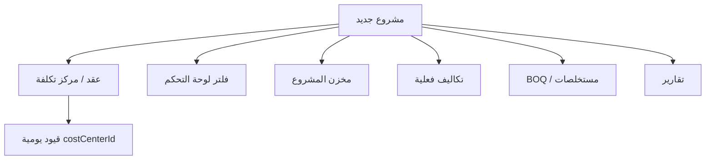

# عرض توضيحي: إنشاء مشروع جديد والأثر الفوري

هذا العرض خارج التطبيق. اللقطات في `screenshots/` وتُحدَّث عبر:

```powershell
npm run docs:demo-project -- --headed
# إن انتهت الجلسة:
npm run docs:demo-project -- --manual-login
```

عرض الشرائح: افتح `slides.html` في المتصفح.

---

## ماذا يُنشأ في هذا العرض؟

| الحقل | القيمة التجريبية |
|--------|------------------|
| كود المشروع | `PRJ-DEMO-YYYYMMDD` (تاريخ التشغيل) |
| الاسم | مشروع تجريبي — عرض إنشاء مشروع |
| العميل | عميل تجريبي Concord |
| العقد | `CRT-DEMO-YYYYMMDD` — عقد تجريبي رئيسي |
| ميزانية إرشادية | 1,500,000 |

عند إنشاء **عقد** يُنشأ تلقائياً مركز تكلفة مباشر (`cost_centers` type=`direct`) بنفس `contractId` — يظهر لاحقاً في قيود اليومية وتوزيع OHA/الرواتب.

---

## التسلسل

### 1) قبل الإنشاء — قائمة المشاريع


المكتب الفني → مشاريع: القائمة الحالية بدون المشروع التجريبي.

### 2) نموذج مشروع جديد


### 3) بعد الحفظ — المشروع في القائمة


**الأثر الفوري هنا:** بطاقة مشروع جديدة، جاهزة للعقود وBOQ والمستخلصات والمخزن.

### 4) إضافة عقد


**الأثر:** عقد = مركز تكلفة للتشغيل (فواتير، مستخلصات، صرف، قيود).

---

## الأثر في باقي الموديولات



### لوحة التحكم


المشروع يظهر ضمن فلاتر المشروع/المقارنة (حتى لو لم تُرحَّل حركات بعد).

### المخازن


يظهر في اختيار مشروع المخزن — يحتاج لاحقاً ربط حساب `127…` لاستلام/صرف.

### التكاليف الفعلية


فلتر المشروع/العقد جاهز لفاتورة أو مستخلص باطن مرتبط بهذا النطاق.

### جداول الكميات


يمكن اختيار المشروع/العقد وبدء بنود BOQ (القائمة فارغة حتى تُضاف بنود).

### المستخلصات


نطاق العميل يظهر بعد وجود عقد + بنود (أو على الأقل عقد للاختيار).

### التقارير


فلتر المشروع في قائمة الدخل/التقارير الأخرى يشمل المشروع الجديد.

### مراكز التكلفة (إعدادات)


مراكز **غير مباشرة** تُدار هنا؛ المركز **المباشر** للعقد يُزامَن تلقائياً مع إنشاء العقد (ليس شرطاً أن يظهر في هذه الشاشة).

---

## ما لا يحدث تلقائياً عند إنشاء المشروع فقط

- لا قيد يومية
- لا مخزون ولا حساب `127…` قبل الربط/الفاتورة
- لا بنود BOQ ولا مستخلصات
- لا يظهر أثر مالي في KPIs حتى تُرحَّل حركات

الإنشاء يفتح **النطاق التشغيلي**؛ الأثر المالي يأتي من الفواتير/الصرف/المستخلصات/البنوك.

---

## إعادة التشغيل

كل تشغيل يولّد كوداً بتاريخ اليوم. التفاصيل في `demo-manifest.json` بعد النجاح.
